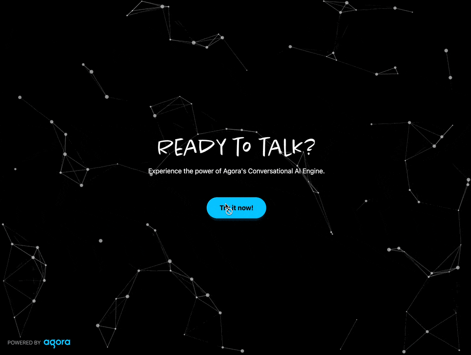
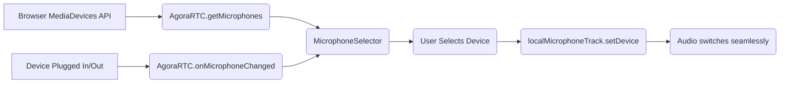

# Give Your Users a Mic Choice: Adding Microphone Device Selection



You've built an amazing conversational AI application. Users can talk to an AI agent, hear responses, and everything works beautifully... until someone plugs in their fancy new USB microphone or their Bluetooth headset connects automatically, and suddenly the app is using the wrong input device. Frustrating, right?

This guide shows you how to add microphone device selection to your Agora-powered conversational AI application. Think of it as giving your users the power to choose exactly which microphone they want to use, without needing to dig into their system settings.

## Why Microphone Selection Matters

Before we dive into the code, let's talk about why this feature is more important than you might think:

1. **Multiple Devices Are the Norm**: Most users have several audio input options – laptop built-in mic, USB headset, Bluetooth earbuds, external microphone, etc.
2. **Quality Varies Dramatically**: A built-in laptop mic in a noisy environment versus a noise-canceling headset? Night and day difference for AI speech recognition.
3. **Automatic Switching Confusion**: Operating systems often auto-switch to newly connected devices. Without in-app control, users might not realize they're using the wrong mic.
4. **Professional Use Cases**: Content creators, remote workers, and professionals expect this level of control in their tools.
5. **Accessibility**: Some users rely on specific assistive audio devices that they need to explicitly select.

Adding device selection transforms your app from "it works on my machine" to "it works the way _you_ want it to work."

## The Blueprint: How Device Selection Fits In

Implementing microphone device selection involves two main components working together:

1. **The Selector (`components/MicrophoneSelector.tsx`)**: A dropdown UI component that lists available devices, shows the current selection, and handles device switching.
2. **The Integration (`components/ConversationComponent.tsx`)**: Your existing conversation component that manages the Agora RTC connection and microphone track. You'll pass the microphone track to the selector so it can switch devices.

Here's how they communicate:



The key insight: Agora's SDK provides all the heavy lifting. We just need to create a clean UI around it.

## Understanding Device Enumeration

Before we can let users choose a device, we need to discover what devices are available. The Agora SDK provides a convenient method for this:

```typescript
// Import AgoraRTC
const AgoraRTC = (await import('agora-rtc-react')).default;

// Get all available microphones
const microphones = await AgoraRTC.getMicrophones();

// Each device has this structure:
interface MediaDeviceInfo {
  deviceId: string;        // Unique identifier (e.g., "default", "abc123...")
  label: string;           // Human-readable name (e.g., "MacBook Pro Microphone")
  kind: 'audioinput';      // Always 'audioinput' for microphones
  groupId: string;         // Groups related devices together
}
```

### Important Gotcha: Permissions First

The browser will only give you detailed device information (like labels) *after* the user has granted microphone permissions. Before permission is granted, you'll get devices but with generic labels like "Microphone 1", "Microphone 2", etc.

In a conversational AI app, this isn't usually a problem because:
1. You need microphone permission to create the `localMicrophoneTrack` anyway
2. By the time users see the device selector, they've already granted permission

### Browser Compatibility

Device enumeration is built on the standard Web API `navigator.mediaDevices.enumerateDevices()`. The Agora SDK wraps this for convenience. It's supported in:

- ✅ Chrome/Edge (all modern versions)
- ✅ Firefox (all modern versions)
- ✅ Safari (desktop and iOS 14.3+)
- ⚠️ Mobile browsers have varying levels of support for device switching (some OSes lock the active device)

## Building the MicrophoneSelector Component

Let's build the component step by step. We'll start with the basic structure and add features progressively.

### Component Structure and Props

First, define what the component needs from its parent:

```typescript
'use client';

import { useState, useEffect } from 'react';
import { IMicrophoneAudioTrack } from 'agora-rtc-react';
import { Settings } from 'lucide-react';
import { Button } from '@/components/ui/button';
import {
  DropdownMenu,
  DropdownMenuContent,
  DropdownMenuItem,
  DropdownMenuTrigger,
} from '@/components/ui/dropdown-menu';

interface MicrophoneSelectorProps {
  localMicrophoneTrack: IMicrophoneAudioTrack | null;
}

interface MicrophoneDevice {
  deviceId: string;
  label: string;
}

export function MicrophoneSelector({
  localMicrophoneTrack,
}: MicrophoneSelectorProps) {
  // Component logic will go here
}
```

We're keeping the props simple – just the microphone track. The component will handle everything else internally.

### State Management

The component needs to track three pieces of state:

```typescript
export function MicrophoneSelector({
  localMicrophoneTrack,
}: MicrophoneSelectorProps) {
  // List of available microphone devices
  const [devices, setDevices] = useState<MicrophoneDevice[]>([]);
  
  // Currently selected device ID
  const [currentDeviceId, setCurrentDeviceId] = useState<string>('');
  
  // Whether the dropdown is open (for controlling UI state)
  const [isOpen, setIsOpen] = useState(false);

  // ... rest of the component
}
```

### Fetching Available Devices

Now the interesting part – getting the list of microphones:

```typescript
const fetchMicrophones = async () => {
  try {
    // Dynamically import AgoraRTC to access the SDK methods
    const AgoraRTC = (await import('agora-rtc-react')).default;
    const microphones = await AgoraRTC.getMicrophones();
    
    // Transform into our simplified format
    const formattedDevices = microphones.map((device) => ({
      deviceId: device.deviceId,
      // Fallback to a truncated ID if label is missing (shouldn't happen after permission)
      label: device.label || `Microphone ${device.deviceId.slice(0, 5)}...`,
    }));
    
    setDevices(formattedDevices);

    // Detect which device is currently active
    if (localMicrophoneTrack) {
      const currentLabel = localMicrophoneTrack.getTrackLabel();
      const currentDevice = microphones.find(
        (device) => device.label === currentLabel
      );
      if (currentDevice) {
        setCurrentDeviceId(currentDevice.deviceId);
      }
    }
  } catch (error) {
    console.error('Error fetching microphones:', error);
  }
};
```

**Why the dynamic import?** In Next.js (or any SSR framework), we need to avoid importing Agora code at build time since it depends on browser APIs. Dynamic imports solve this elegantly.

### Running the Fetch on Mount

Use `useEffect` to fetch devices when the component mounts and when the track changes:

```typescript
useEffect(() => {
  if (localMicrophoneTrack) {
    fetchMicrophones();
  }
}, [localMicrophoneTrack]);
```

This ensures we always have an up-to-date device list and know which device is active.

### Handling Device Switching

When a user selects a different device from the dropdown, we need to tell Agora to switch to it:

```typescript
const handleDeviceChange = async (deviceId: string) => {
  if (!localMicrophoneTrack) return;

  try {
    // This is the magic line – Agora handles all the complexity
    await localMicrophoneTrack.setDevice(deviceId);
    
    // Update our local state to reflect the change
    setCurrentDeviceId(deviceId);
    
    console.log('Microphone device changed to:', deviceId);
  } catch (error) {
    console.error('Error changing microphone device:', error);
    // In production, you might want to show a user-friendly error message here
  }
};
```

The `setDevice()` method is remarkably powerful:
- ✅ Switches the audio input seamlessly
- ✅ Doesn't interrupt the ongoing RTC session
- ✅ Handles the underlying MediaStream management
- ✅ Works even during an active conversation

### Hot-Swap: Detecting Device Changes

One of the best UX enhancements is automatically detecting when devices are plugged in or unplugged. Agora provides a callback mechanism for this:

```typescript
useEffect(() => {
  const setupDeviceChangeListener = async () => {
    try {
      const AgoraRTC = (await import('agora-rtc-react')).default;
      
      // Register our callback for device changes
      AgoraRTC.onMicrophoneChanged = async (changedDevice) => {
        console.log('Microphone changed:', changedDevice);
        
        // Refresh the device list to show the updated state
        await fetchMicrophones();
        
        // If a new device was connected and is now active
        if (changedDevice.state === 'ACTIVE' && localMicrophoneTrack) {
          await localMicrophoneTrack.setDevice(changedDevice.device.deviceId);
          setCurrentDeviceId(changedDevice.device.deviceId);
        } 
        // If the current device was unplugged
        else if (
          changedDevice.device.label === localMicrophoneTrack?.getTrackLabel() &&
          changedDevice.state === 'INACTIVE'
        ) {
          // Gracefully fall back to the first available device
          const microphones = await AgoraRTC.getMicrophones();
          if (microphones[0] && localMicrophoneTrack) {
            await localMicrophoneTrack.setDevice(microphones[0].deviceId);
            setCurrentDeviceId(microphones[0].deviceId);
          }
        }
      };
    } catch (error) {
      console.error('Error setting up device change listener:', error);
    }
  };

  setupDeviceChangeListener();

  // Cleanup: Remove the listener when component unmounts
  return () => {
    import('agora-rtc-react').then(({ default: AgoraRTC }) => {
      AgoraRTC.onMicrophoneChanged = undefined;
    });
  };
}, [localMicrophoneTrack]);
```

This provides a seamless experience:
- 🎧 User plugs in a headset → App automatically switches to it
- 🔌 User unplugs the current device → App gracefully falls back to another device
- 📱 Multiple devices changing → App stays in sync

### Rendering the UI

Now let's build the actual dropdown interface. Notice we're being smart about when to show it:

```typescript
// Only show selector if there are multiple devices to choose from
if (devices.length <= 1) {
  return null;
}

const currentDevice = devices.find((d) => d.deviceId === currentDeviceId);

return (
  <DropdownMenu open={isOpen} onOpenChange={setIsOpen}>
    <DropdownMenuTrigger asChild>
      <Button
        variant="ghost"
        size="icon"
        className="rounded-full w-10 h-10 bg-gray-800/50 hover:bg-gray-700/50 backdrop-blur-sm border border-gray-600"
        title="Select microphone"
      >
        <Settings className="h-4 w-4 text-white" />
      </Button>
    </DropdownMenuTrigger>
    
    <DropdownMenuContent
      align="center"
      className="w-64 bg-gray-900 border-gray-700"
    >
      {/* Section header */}
      <div className="px-2 py-1.5 text-xs font-semibold text-gray-400">
        Microphone
      </div>
      
      {/* Device list */}
      {devices.map((device) => (
        <DropdownMenuItem
          key={device.deviceId}
          onClick={() => handleDeviceChange(device.deviceId)}
          className={`cursor-pointer ${
            device.deviceId === currentDeviceId
              ? 'bg-cyan-500/20 text-cyan-400'
              : 'text-white hover:bg-gray-800'
          }`}
        >
          <span className="truncate">{device.label}</span>
          {/* Show checkmark for active device */}
          {device.deviceId === currentDeviceId && (
            <span className="ml-auto text-cyan-400">✓</span>
          )}
        </DropdownMenuItem>
      ))}
    </DropdownMenuContent>
  </DropdownMenu>
);
```

**Why check for `<= 1` instead of `=== 0`?**

If there's only one microphone available, there's no choice to make! Showing a selector with one option is pointless UI clutter. The component only appears when there are 2+ devices, giving users a meaningful choice. This is a better UX – the interface adapts to what's actually useful.

### Design Considerations

The UI choices here are intentional:

1. **Settings Icon**: Universal symbol for configuration, doesn't take up much space
2. **Dropdown vs Modal**: Dropdown is faster to access and less disruptive during a conversation
3. **Checkmark Indicator**: Clear visual feedback showing the current device
4. **Label Truncation**: Device names can be long; `truncate` keeps the UI clean
5. **Conditional Rendering**: Only shows when there are multiple devices (2+) to choose from

## Full Component Code

Here's the complete `MicrophoneSelector.tsx` component:

```typescript
'use client';

import { useState, useEffect } from 'react';
import { IMicrophoneAudioTrack } from 'agora-rtc-react';
import { Settings } from 'lucide-react';
import { Button } from '@/components/ui/button';
import {
  DropdownMenu,
  DropdownMenuContent,
  DropdownMenuItem,
  DropdownMenuTrigger,
} from '@/components/ui/dropdown-menu';

interface MicrophoneSelectorProps {
  localMicrophoneTrack: IMicrophoneAudioTrack | null;
}

interface MicrophoneDevice {
  deviceId: string;
  label: string;
}

export function MicrophoneSelector({
  localMicrophoneTrack,
}: MicrophoneSelectorProps) {
  const [devices, setDevices] = useState<MicrophoneDevice[]>([]);
  const [currentDeviceId, setCurrentDeviceId] = useState<string>('');
  const [isOpen, setIsOpen] = useState(false);

  // Fetch available microphones
  const fetchMicrophones = async () => {
    try {
      const AgoraRTC = (await import('agora-rtc-react')).default;
      const microphones = await AgoraRTC.getMicrophones();
      
      const formattedDevices = microphones.map((device) => ({
        deviceId: device.deviceId,
        label: device.label || `Microphone ${device.deviceId.slice(0, 5)}...`,
      }));
      
      setDevices(formattedDevices);

      if (localMicrophoneTrack) {
        const currentLabel = localMicrophoneTrack.getTrackLabel();
        const currentDevice = microphones.find(
          (device) => device.label === currentLabel
        );
        if (currentDevice) {
          setCurrentDeviceId(currentDevice.deviceId);
        }
      }
    } catch (error) {
      console.error('Error fetching microphones:', error);
    }
  };

  // Fetch devices on mount and when track changes
  useEffect(() => {
    if (localMicrophoneTrack) {
      fetchMicrophones();
    }
  }, [localMicrophoneTrack]);

  // Handle device change
  const handleDeviceChange = async (deviceId: string) => {
    if (!localMicrophoneTrack) return;

    try {
      await localMicrophoneTrack.setDevice(deviceId);
      setCurrentDeviceId(deviceId);
      console.log('Microphone device changed to:', deviceId);
    } catch (error) {
      console.error('Error changing microphone device:', error);
    }
  };

  // Hot-swap: Listen for device changes
  useEffect(() => {
    const setupDeviceChangeListener = async () => {
      try {
        const AgoraRTC = (await import('agora-rtc-react')).default;
        
        AgoraRTC.onMicrophoneChanged = async (changedDevice) => {
          console.log('Microphone changed:', changedDevice);
          
          await fetchMicrophones();
          
          if (changedDevice.state === 'ACTIVE' && localMicrophoneTrack) {
            await localMicrophoneTrack.setDevice(changedDevice.device.deviceId);
            setCurrentDeviceId(changedDevice.device.deviceId);
          } else if (
            changedDevice.device.label === localMicrophoneTrack?.getTrackLabel() &&
            changedDevice.state === 'INACTIVE'
          ) {
            const microphones = await AgoraRTC.getMicrophones();
            if (microphones[0] && localMicrophoneTrack) {
              await localMicrophoneTrack.setDevice(microphones[0].deviceId);
              setCurrentDeviceId(microphones[0].deviceId);
            }
          }
        };
      } catch (error) {
        console.error('Error setting up device change listener:', error);
      }
    };

    setupDeviceChangeListener();

    return () => {
      import('agora-rtc-react').then(({ default: AgoraRTC }) => {
        AgoraRTC.onMicrophoneChanged = undefined;
      });
    };
  }, [localMicrophoneTrack]);

  // Only show selector if there are multiple devices to choose from
  if (devices.length <= 1) {
    return null;
  }

  const currentDevice = devices.find((d) => d.deviceId === currentDeviceId);

  return (
    <DropdownMenu open={isOpen} onOpenChange={setIsOpen}>
      <DropdownMenuTrigger asChild>
        <Button
          variant="ghost"
          size="icon"
          className="rounded-full w-10 h-10 bg-gray-800/50 hover:bg-gray-700/50 backdrop-blur-sm border border-gray-600"
          title="Select microphone"
        >
          <Settings className="h-4 w-4 text-white" />
        </Button>
      </DropdownMenuTrigger>
      <DropdownMenuContent
        align="center"
        className="w-64 bg-gray-900 border-gray-700"
      >
        <div className="px-2 py-1.5 text-xs font-semibold text-gray-400">
          Microphone
        </div>
        {devices.map((device) => (
          <DropdownMenuItem
            key={device.deviceId}
            onClick={() => handleDeviceChange(device.deviceId)}
            className={`cursor-pointer ${
              device.deviceId === currentDeviceId
                ? 'bg-cyan-500/20 text-cyan-400'
                : 'text-white hover:bg-gray-800'
            }`}
          >
            <span className="truncate">{device.label}</span>
            {device.deviceId === currentDeviceId && (
              <span className="ml-auto text-cyan-400">✓</span>
            )}
          </DropdownMenuItem>
        ))}
      </DropdownMenuContent>
    </DropdownMenu>
  );
}
```

## Integrating with ConversationComponent

Now that we have our selector component, let's integrate it into the main conversation UI. The integration is straightforward – we just need to pass the microphone track to the selector.

### Import the Component

First, add the import at the top of your `ConversationComponent.tsx`:

```typescript
import { MicrophoneButton } from './MicrophoneButton';
import { MicrophoneSelector } from './MicrophoneSelector'; // Add this line
```

### Place It in the UI

The selector works best placed next to the microphone button. In your `ConversationComponent`'s return statement, update the controls section:

```typescript
{/* Local Controls - Fixed at bottom center */}
<div className="fixed bottom-14 md:bottom-8 left-1/2 -translate-x-1/2 flex items-center gap-3">
  {/* Existing microphone button */}
  <MicrophoneButton
    isEnabled={isEnabled}
    setIsEnabled={setIsEnabled}
    localMicrophoneTrack={localMicrophoneTrack}
  />
  
  {/* New microphone selector */}
  <MicrophoneSelector localMicrophoneTrack={localMicrophoneTrack} />
</div>
```

That's it! The selector and button share the same `localMicrophoneTrack`, so they stay in sync automatically.

### Visual Positioning

The example above uses Tailwind CSS classes to:
- `flex items-center gap-3`: Arrange components horizontally with spacing
- `fixed bottom-14 md:bottom-8`: Position at the bottom (responsive)
- `left-1/2 -translate-x-1/2`: Center horizontally

Feel free to adjust the positioning to match your app's design. Some alternatives:

**Top-right corner** (like a settings panel):
```typescript
<div className="fixed top-4 right-4 flex items-center gap-2">
```

**Inline with other controls**:
```typescript
<div className="flex justify-center items-center gap-4 p-4">
```

## Styling and Customization

The provided component uses shadcn/ui components and Tailwind CSS, but the approach is flexible. Let's explore customization options.

### Changing the Trigger Button

The settings icon is clear and universal, but you might want something different:

```typescript
{/* Alternative: Text button */}
<Button variant="outline" className="gap-2">
  <Settings className="h-4 w-4" />
  <span>Microphone</span>
</Button>

{/* Alternative: Just text with current device name */}
<Button variant="ghost">
  {currentDevice?.label || 'Select Microphone'}
</Button>
```

### Dropdown Styling

Match your app's design system by adjusting the classes:

```typescript
<DropdownMenuContent
  align="center"
  className="w-80 bg-slate-950 border-slate-800 rounded-lg shadow-xl"
>
  <div className="px-3 py-2 text-sm font-medium text-slate-400 border-b border-slate-800">
    🎤 Select Your Microphone
  </div>
  {/* ... */}
</DropdownMenuContent>
```

### Adding Device Icons

Enhance the visual feedback by showing device type icons:

```typescript
import { Headphones, Mic } from 'lucide-react';

// In the device mapping:
{devices.map((device) => {
  // Simple heuristic to guess device type
  const isHeadset = device.label.toLowerCase().includes('headset') || 
                    device.label.toLowerCase().includes('headphone');
  
  return (
    <DropdownMenuItem key={device.deviceId} onClick={() => handleDeviceChange(device.deviceId)}>
      {isHeadset ? <Headphones className="h-4 w-4 mr-2" /> : <Mic className="h-4 w-4 mr-2" />}
      <span className="truncate">{device.label}</span>
      {device.deviceId === currentDeviceId && <span className="ml-auto">✓</span>}
    </DropdownMenuItem>
  );
})}
```

### Mobile Considerations

On mobile, a bottom sheet might work better than a dropdown:

```typescript
// Detect mobile
const isMobile = /iPhone|iPad|iPod|Android/i.test(navigator.userAgent);

// Use different UI on mobile
{isMobile ? (
  <Sheet open={isOpen} onOpenChange={setIsOpen}>
    <SheetTrigger asChild>
      <Button variant="ghost" size="icon">
        <Settings />
      </Button>
    </SheetTrigger>
    <SheetContent side="bottom">
      <SheetHeader>
        <SheetTitle>Select Microphone</SheetTitle>
      </SheetHeader>
      <div className="grid gap-2 py-4">
        {devices.map((device) => (
          // ... render device buttons
        ))}
      </div>
    </SheetContent>
  </Sheet>
) : (
  // Desktop dropdown as before
  <DropdownMenu>...</DropdownMenu>
)}
```

## Advanced Features and Enhancements

Once you have the basic device selector working, consider these enhancements for a more polished experience.

### Persisting Device Preference

Save the user's preferred device so they don't have to reselect it every time:

```typescript
const handleDeviceChange = async (deviceId: string) => {
  if (!localMicrophoneTrack) return;

  try {
    await localMicrophoneTrack.setDevice(deviceId);
    setCurrentDeviceId(deviceId);
    
    // Save to localStorage
    localStorage.setItem('preferredMicrophoneId', deviceId);
    
    console.log('Microphone device changed and saved:', deviceId);
  } catch (error) {
    console.error('Error changing microphone device:', error);
  }
};

// On component mount, try to restore preference
useEffect(() => {
  const restorePreferredDevice = async () => {
    const preferredId = localStorage.getItem('preferredMicrophoneId');
    if (preferredId && localMicrophoneTrack) {
      try {
        await localMicrophoneTrack.setDevice(preferredId);
        setCurrentDeviceId(preferredId);
      } catch (error) {
        // Device might not be available anymore, that's okay
        console.log('Preferred device not available:', error);
      }
    }
  };

  if (localMicrophoneTrack && devices.length > 0) {
    restorePreferredDevice();
  }
}, [localMicrophoneTrack, devices]);
```

### Adding a "Test" Feature

Let users test their microphone before starting a conversation:

```typescript
const [isTesting, setIsTesting] = useState(false);

const testMicrophone = async () => {
  if (!localMicrophoneTrack) return;
  
  setIsTesting(true);
  
  // Enable the track if it's not already
  if (!isEnabled) {
    await localMicrophoneTrack.setEnabled(true);
  }
  
  // Show audio visualization or volume meter for 5 seconds
  setTimeout(() => {
    setIsTesting(false);
  }, 5000);
};

// In the dropdown UI:
<DropdownMenuItem onClick={testMicrophone}>
  <Volume2 className="h-4 w-4 mr-2" />
  Test Microphone
</DropdownMenuItem>
```

### Showing Device Status

Display additional information about each device:

```typescript
interface MicrophoneDevice {
  deviceId: string;
  label: string;
  isDefault?: boolean;  // Is this the system default?
  quality?: 'high' | 'medium' | 'low';  // Audio quality estimate
}

// During device enumeration:
const formattedDevices = microphones.map((device) => ({
  deviceId: device.deviceId,
  label: device.label || `Microphone ${device.deviceId.slice(0, 5)}...`,
  isDefault: device.deviceId === 'default',
  // You could add logic to estimate quality based on device type
  quality: estimateQuality(device.label),
}));

// In the UI:
<DropdownMenuItem key={device.deviceId}>
  <div className="flex flex-col">
    <span className="truncate">{device.label}</span>
    <div className="flex gap-2 text-xs text-gray-500">
      {device.isDefault && <span>Default</span>}
      {device.quality === 'high' && <span className="text-green-500">HD Quality</span>}
    </div>
  </div>
</DropdownMenuItem>
```

### Audio Output (Speaker) Selection

The same pattern works for audio output devices. Here's a quick example:

```typescript
// Get playback devices
const speakers = await AgoraRTC.getPlaybackDevices();

// For remote audio tracks
remoteUser.audioTrack?.setPlaybackDevice(speakerId);
```

You could build a companion `SpeakerSelector` component using the exact same approach.

## Troubleshooting Common Issues

### No Devices Showing Up

**Problem**: The dropdown is empty or doesn't appear.

**Solutions**:
1. Check that microphone permissions were granted:
   ```typescript
   navigator.permissions.query({ name: 'microphone' }).then((result) => {
     console.log('Microphone permission:', result.state);
   });
   ```
2. Ensure `localMicrophoneTrack` is not null before rendering
3. Check console for errors during `getMicrophones()` call

### Device Labels Are Generic ("Microphone 1", "Microphone 2")

**Problem**: Device labels aren't showing the actual device names.

**Solution**: This happens when permissions haven't been fully granted yet. Make sure the user has already allowed microphone access before showing the selector. In practice, since the conversation needs the mic anyway, this usually resolves itself.

### Device Switching Fails Mid-Conversation

**Problem**: Calling `setDevice()` throws an error or doesn't work.

**Solutions**:
1. Verify the device ID is valid and the device still exists
2. Check that the track is still active (not closed)
3. Ensure the device isn't already in use by another application
4. Try stopping and restarting the track if switching fails:
   ```typescript
   try {
     await localMicrophoneTrack.setDevice(deviceId);
   } catch (error) {
     console.error('Switch failed, attempting restart:', error);
     await localMicrophoneTrack.close();
     // Recreate the track with new device...
   }
   ```

### Hot-Swap Not Working

**Problem**: Plugging/unplugging devices doesn't trigger the `onMicrophoneChanged` callback.

**Solutions**:
1. Make sure you're setting up the listener after Agora is fully loaded
2. Check browser support – some browsers have limited hot-swap detection
3. Verify the callback isn't being overwritten elsewhere in your code
4. Try refreshing the device list manually with a "Refresh" button as a fallback

### Mobile Device Switching Not Working

**Problem**: Device selection doesn't work on mobile browsers.

**Explanation**: Some mobile operating systems (especially iOS) restrict audio device management for security/privacy reasons. The OS controls which device is active (e.g., when you connect Bluetooth headphones).

**Workaround**: On mobile, you might want to hide the device selector and add a note that device switching is controlled by the OS settings.

## Testing Your Implementation

Here's a checklist to ensure your device selector works correctly:

### Basic Functionality
- [ ] Dropdown opens when clicking the settings icon
- [ ] All connected microphones appear in the list
- [ ] Current device is highlighted with a checkmark
- [ ] Clicking a device switches to it successfully
- [ ] Audio continues working after switching devices

### Hot-Swap Behavior
- [ ] Plugging in a USB microphone updates the list
- [ ] Unplugging the current device falls back gracefully
- [ ] Connecting Bluetooth headphones switches automatically
- [ ] Disconnecting Bluetooth falls back to previous device

### Edge Cases
- [ ] Works correctly when only one device is available
- [ ] Handles missing device labels gracefully
- [ ] Doesn't break when microphone permissions are denied
- [ ] Properly cleans up listeners on component unmount
- [ ] Doesn't interfere with ongoing conversations

### Cross-Browser Testing
- [ ] Chrome/Edge (Windows, Mac, Linux)
- [ ] Firefox (Windows, Mac, Linux)
- [ ] Safari (Mac and iOS)
- [ ] Mobile browsers (iOS Safari, Chrome Mobile, Samsung Internet)

## The Big Picture: User Flow

Let's walk through the complete user experience:

1. **Initial Join**: User joins the conversation. App requests microphone permission.
2. **Permission Granted**: Microphone track is created with the system default device.
3. **Device Discovery**: MicrophoneSelector fetches available devices and identifies the current one.
4. **User Notices**: User realizes they want to use their headset instead of the laptop mic.
5. **Selection**: User clicks the settings icon, sees the device list, selects "USB Headset."
6. **Seamless Switch**: Audio immediately switches to the new device without disconnecting.
7. **Preference Saved**: Next time they join, the app remembers their preference.
8. **Hot-Swap**: Later, they plug in a new microphone. App detects it and shows it in the list.
9. **Graceful Fallback**: They unplug their headset. App automatically falls back to the laptop mic.

At every step, the user stays in control while the app handles the technical complexity behind the scenes.

## Where to Go Next

You now have a production-ready microphone device selector! Here are some ideas to take it further:

**Immediate Enhancements:**
1. Add speaker/audio output device selection using the same pattern
2. Implement device preference persistence with localStorage
3. Add a visual audio level meter next to each device

**Advanced Features:**
1. Show device sample rate and channel information
2. Add automatic device quality testing and recommendations
3. Implement keyboard shortcuts for device switching
4. Add accessibility improvements (ARIA labels, keyboard navigation)

**Related Documentation:**
- [Agora Device Management](https://docs.agora.io/en/voice-calling/develop/product-workflow?platform=web#audio-and-video-device-management)
- [MediaDevices API (MDN)](https://developer.mozilla.org/en-US/docs/Web/API/MediaDevices)
- [Main Conversational AI Guide](./GUIDE.md)

Happy coding, and may your users always have the perfect microphone selected! 🎤
