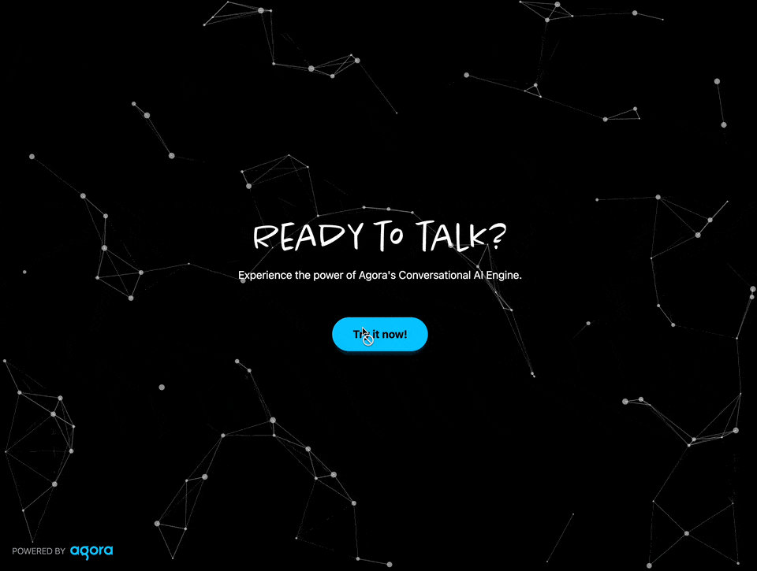

# Conversational AI: Dev Advocate Agent Demo

A feature-rich Next.js web application demonstrating real-time conversational AI capabilities using Agora's Real-Time Communication SDK. This demo showcases voice-first interactions with live transcriptions, multi-device audio input support, and an Agent ready to help you wiht your Agora build.



## Overview

This application demonstrates how to build a production-ready conversational AI interface with:
- **Real-time voice conversations** with AI agents powered by Agora's Conversational AI Engine
- **Live text transcriptions** with streaming message updates and visual status indicators
- **Advanced audio controls** including device selection and visual feedback
- **Modern UX patterns** like smart auto-scrolling, mobile responsiveness, and accessibility features
- **Flexible backend integration** supporting multiple LLM providers (OpenAI, Anthropic, etc.) and TTS services (Microsoft Azure, ElevenLabs)

## Guides and Documentation

- [Guide.md](./DOCS/GUIDE.md) - Complete step-by-step guide on how to build this application from scratch.
- [User Interaction Diagram](./DOCS/User-Interaction-Diagram.md) - Visual diagram showing how the application interacts with different services.
- [Text Streaming Guide](./DOCS/TEXT_STREAMING_GUIDE.md) - Deep dive into implementing real-time conversation transcriptions.
- [Microphone Selector Implementation](./DOCS/MICROPHONE_SELECTOR_IMPLEMENTATION.md) - Guide for adding device selection functionality.

## Prerequisites

Before you begin, ensure you have the following installed:

- [Node.js](https://nodejs.org/) (version 16.x or higher)
- [pnpm](https://pnpm.io/) (version 8.x or higher)

You must have an Agora account and a project to use this application.

- [Agora Account](https://console.agora.io/)

## Installation

1. Clone the repository:

```bash
git clone https://github.com/AgoraIO-Community/conversational-ai-nextjs-client
cd conversational-ai-nextjs-client
```

2. Install dependencies:

```bash
pnpm install
```

3. Create a `.env.local` file in the root directory and add your environment variables:

```bash
cp .env.local.example .env.local
```

The following environment variables are required:

### Agora Configuration

- `NEXT_PUBLIC_AGORA_APP_ID` - Your Agora App ID
- `NEXT_AGORA_APP_CERTIFICATE` - Your Agora App Certificate
- `NEXT_AGORA_CONVO_AI_BASE_URL` - Agora Conversation AI Base URL
- `NEXT_AGORA_CUSTOMER_ID` - Your Agora Customer ID
- `NEXT_AGORA_CUSTOMER_SECRET` - Your Agora Customer Secret
- `NEXT_AGENT_UID` - Agent UID (defaults to "Agent")

### LLM Configuration

- `NEXT_LLM_URL` - LLM API endpoint URL
- `NEXT_LLM_TOKEN` - LLM API authentication token
- `NEXT_LLM_MODEL` - LLM model to use (optional)

### TTS Configuration

Choose one of the following TTS providers:

#### Microsoft TTS

- `NEXT_TTS_VENDOR=microsoft`
- `NEXT_MICROSOFT_TTS_KEY` - Microsoft TTS API key
- `NEXT_MICROSOFT_TTS_REGION` - Microsoft TTS region
- `NEXT_MICROSOFT_TTS_VOICE_NAME` - Voice name (optional, defaults to 'en-US-AndrewMultilingualNeural')
- `NEXT_MICROSOFT_TTS_RATE` - Speech rate (optional, defaults to 1.0)
- `NEXT_MICROSOFT_TTS_VOLUME` - Volume (optional, defaults to 100.0)

#### ElevenLabs

- `NEXT_TTS_VENDOR=elevenlabs`
- `NEXT_ELEVENLABS_API_KEY` - ElevenLabs API key
- `NEXT_ELEVENLABS_VOICE_ID` - ElevenLabs voice ID
- `NEXT_ELEVENLABS_MODEL_ID` - Model ID (optional, defaults to 'eleven_flash_v2_5')

### Modalities Configuration

- `NEXT_INPUT_MODALITIES` - Comma-separated list of input modalities (defaults to 'text')
- `NEXT_OUTPUT_MODALITIES` - Comma-separated list of output modalities (defaults to 'text,audio')

4. Run the development server:

```bash
pnpm dev
```

4. Open your browser and navigate to `http://localhost:3000` to see the application in action.

## Deployment to Vercel

This project is configured for quick deployments to Vercel.

[](https://vercel.com/new/clone?repository-url=https%3A%2F%2Fgithub.com%2FAgoraIO-Community%2Fconversational-ai-nextjs-client&project-name=conversational-ai-nextjs-client&repository-name=conversational-ai-nextjs-client&env=NEXT_PUBLIC_AGORA_APP_ID,NEXT_AGORA_APP_CERTIFICATE,NEXT_AGORA_CUSTOMER_ID,NEXT_AGORA_CUSTOMER_SECRET,NEXT_AGENT_UID,NEXT_LLM_API_KEY,NEXT_MICROSOFT_TTS_KEY,NEXT_ELEVENLABS_API_KEY&envDescription=API%20keys%20needed%20for%20the%20application&envLink=https://github.com/AgoraIO-Community/conversational-ai-nextjs-client%23prerequisites&demo-title=Conversational%20AI%20Demo&demo-description=A%20Next.js-based%20web-app%20for%20conversational%20AI%20agents&demo-image=https://raw.githubusercontent.com/AgoraIO-Community/conversational-ai-nextjs-client/main/.github/assets/Conversation-Ai-Client.gif&defaultValues=NEXT_AGORA_CONVO_AI_BASE_URL=https://api.agora.io/api/conversational-ai-agent/v2/projects/,NEXT_LLM_URL=https://api.openai.com/v1/chat/completions,NEXT_LLM_MODEL=gpt-4,NEXT_TTS_VENDOR=microsoft,NEXT_MICROSOFT_TTS_REGION=eastus,NEXT_MICROSOFT_TTS_VOICE_NAME=en-US-AndrewMultilingualNeural,NEXT_ELEVENLABS_VOICE_ID=XrExE9yKIg1WjnnlVkGX,NEXT_ELEVENLABS_MODEL_ID=eleven_flash_v2_5,NEXT_INPUT_MODALITIES=text,NEXT_OUTPUT_MODALITIES=text%2Caudio)

This will:

1. Clone the repository to your GitHub account
2. Create a new project on Vercel
3. Prompt you to fill in the required environment variables:
   - **Required**: Agora credentials (`NEXT_PUBLIC_AGORA_APP_ID`, `NEXT_AGORA_APP_CERTIFICATE`, etc.)
   - **Required**: LLM API key (`NEXT_LLM_API_KEY`) - OpenAI API key by default
   - **Required**: Either Microsoft TTS key (`NEXT_MICROSOFT_TTS_KEY`) or ElevenLabs API key (`NEXT_ELEVENLABS_API_KEY`)
   - Other variables have defaults if values are not provided
4. Deploy the application automatically

## Features

### 🎙️ Audio Input Control
- **Microphone Toggle**: Easy-to-use button to enable/disable your microphone
- **Device Selection**: Choose from multiple microphone inputs with the microphone selector dropdown
- **Hot-Swap Support**: Automatically detects when devices are plugged in/unplugged
- **Audio Visualization**: Real-time visual feedback showing microphone input levels

### 💬 Real-Time Text Streaming
- **Live Transcriptions**: See what you say and the AI's responses in real-time as text
- **Message Status Indicators**: Visual feedback for in-progress, completed, and interrupted messages
- **Smart Auto-Scroll**: Automatically scrolls to new messages while preserving scroll position when reviewing history
- **Mobile-Responsive Chat UI**: Collapsible chat window that adapts to different screen sizes
- **Desktop Auto-Open**: Chat window automatically opens on first message (desktop only)
- **Message Persistence**: Full conversation history maintained throughout the session

### 🤖 AI Conversation Engine
- **Custom LLM Integration**: Connect your preferred LLM (OpenAI, Anthropic, etc.)
- **Multiple TTS Providers**: Support for Microsoft Azure TTS and ElevenLabs
- **Voice Activity Detection**: Smart VAD settings for natural conversation flow
- **Token Management**: Automatic token renewal to prevent disconnections
- **Agent Control**: Start, stop, and restart AI agent during the conversation

### 🎨 User Experience
- **Audio Visualizations**: Animated frequency bars for both user and AI audio
- **Connection Status**: Real-time connection indicators
- **Error Handling**: Graceful error messages and recovery options
- **Accessibility**: ARIA labels and keyboard-friendly controls

## Voice Options

### Microsoft TTS

Male voices:
- en-US-AndrewMultilingualNeural (default)
- en-US-ChristopherNeural (casual, friendly)
- en-US-GuyNeural (professional)
- en-US-JasonNeural (clear, energetic)
- en-US-TonyNeural (enthusiastic)

Female voices:
- en-US-JennyNeural (assistant-like)
- en-US-AriaNeural (professional)
- en-US-EmmaNeural (friendly)
- en-US-SaraNeural (warm)

Try voices: https://speech.microsoft.com/portal/voicegallery

### ElevenLabs

Try voices: https://elevenlabs.io/app/voice-lab

## Key Components

The application is built with a modular component architecture:

### Core Components

- **`LandingPage.tsx`**: Entry point that initializes the Agora client and manages the conversation lifecycle
- **`ConversationComponent.tsx`**: Main conversation container handling RTC connections, agent management, and audio/text streaming
- **`MicrophoneButton.tsx`**: Interactive button with built-in audio visualization for microphone control
- **`MicrophoneSelector.tsx`**: Dropdown component for selecting audio input devices with hot-swap support
- **`ConvoTextStream.tsx`**: Real-time text transcription display with smart scrolling and message management
- **`AudioVisualizer.tsx`**: Visual feedback component showing audio frequency data for remote users

### Utilities

- **`lib/message.ts`**: MessageEngine for processing and managing conversation transcriptions
- **`lib/utils.ts`**: Helper functions including markdown rendering for chat messages
- **`types/conversation.ts`**: TypeScript type definitions for conversation data structures

## Contributing

Contributions are welcome! Please feel free to submit a Pull Request.

## API Endpoints

The application provides the following API endpoints:

### Generate Agora Token

- **Endpoint**: `/api/generate-agora-token`
- **Method**: GET
- **Query Parameters**:
  - `uid` (optional) - User ID (defaults to 0)
  - `channel` (optional) - Channel name (auto-generated if not provided)
- **Response**: Returns token, uid, and channel information

### Invite Agent

- **Endpoint**: `/api/invite-agent`
- **Method**: POST
- **Body**:

```typescript
{
  requester_id: string;
  channel_name: string;
  input_modalities?: string[];
  output_modalities?: string[];
}
```

### Stop Conversation

- **Endpoint**: `/api/stop-conversation`
- **Method**: POST
- **Body**:

```typescript
{
  agent_id: string;
}
```

## Technical Implementation Details

### Text Streaming Architecture

The text streaming feature uses Agora's MessageEngine to handle real-time transcriptions:

1. **MessageEngine** (`lib/message.ts`) processes incoming stream messages from the Agora data channel
2. **ConversationComponent** manages message state and updates, separating in-progress messages from completed ones
3. **ConvoTextStream** renders the UI with smart scrolling and visual indicators for message status

Message states include:
- `IN_PROGRESS`: Currently being transcribed/streamed
- `END`: Successfully completed message
- `INTERRUPTED`: Message cut off by user or system

### Microphone Device Management

The MicrophoneSelector component provides:

- **Device enumeration** via `AgoraRTC.getMicrophones()`
- **Hot-swap detection** through `AgoraRTC.onMicrophoneChanged` callbacks
- **Seamless switching** using `localMicrophoneTrack.setDevice(deviceId)`
- **Automatic fallback** when the current device is disconnected

### Audio Visualization

Both the MicrophoneButton and AudioVisualizer components use the Web Audio API:

- Creates an `AudioContext` and `AnalyserNode`
- Connects to the Agora audio track's MediaStream
- Uses `getByteFrequencyData()` to extract frequency information
- Animates visual bars using `requestAnimationFrame` for smooth 60fps updates
